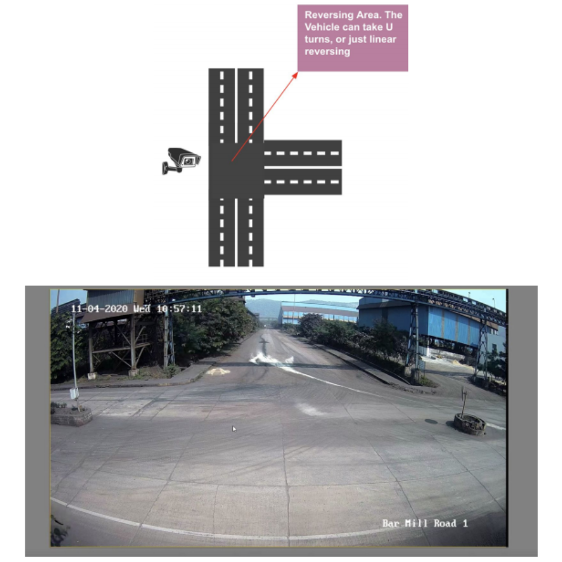

# VehicleReversing_IITGn_IIQ

* ## Instructions to run the code

      python3 reversing_detector.py --video=truck_reversing.mp4 
      or
      python reversing_detector.py --video=truck_reversing.mp4 

   When reversing for some object is detected, color of label of that object changes from 
  <b> GREEN to RED. </b>

* ## Requirements:
  Python 3 --version 3.8  
  playsound module
  
* ## Problem Statement:
    To detect vehicle reversing at a T-junction and raise an alert signal if any human was present in that area. 
    The insufficient view and hence lack of judgement makes it difficult for truck drivers to reverse the trucks in large manufacturing industries. On top of this, if a driver was even a bit careless or not attentive while reversing the truck, and someone behind the truck was also not attentive, perhaps because he was busy with his/her work or couldn’t realize the presence of a truck reversing, then this could lead to a severe mishap. If the frequency of trucks moving in and out of the industry is large, then the probability of occurrence of such an event increases, and which can be dangerous because its consequence could be as bad as loss of life. 
    
    Hence we are required to design an alert system that will raise an alarm whenever reversing happens at the T-joint so that everyone is aware of the same, and hence safe.

 Camera View at T-joint

* ## Approach
  * YOLO object detection algorithm to detect various types of objects in the frame and get centroid of each object in each frame.
  * A centroid tracker algorithm to keep track of the centroid of each detected object.
  * A heurestics based algorithm to device the type of motion (reversing / non-reversing) of each detected object based on the movement of its centroid.

* ## Results:
  [Output video](https://drive.google.com/file/d/1LQa1HwsG1Zy99FlIjpyexHj5GHMzz9dD/view?usp=sharing)
  

 As the truck in the input video starts to reverse, its label color changes from GREEN to RED 

 
* ## Advantages of the algorithm:
  * Can detect truck reversing for trucks coming from the front, left or right, essentially for all possible directions.  
  * Can detect reversing within 1-2 seconds of start of reversing motion of the object.  
  * The Centroid tracker algorithm used will keep track of the same object even if it was lost, meaning it could not be detected by the YOLO algorithm for some time after being detected once.

* ## Limitations:
  * Between the previous halt and the next halt, if there are not enough sets of n frames, then we might not be able to calculate the correct direction of the object before the next halt.
  * Not multi-threaded, but can be done.

* ## Future work:
  * Setting up an Alarm system, i.e. deploying the algorithm on an edge device.
  
